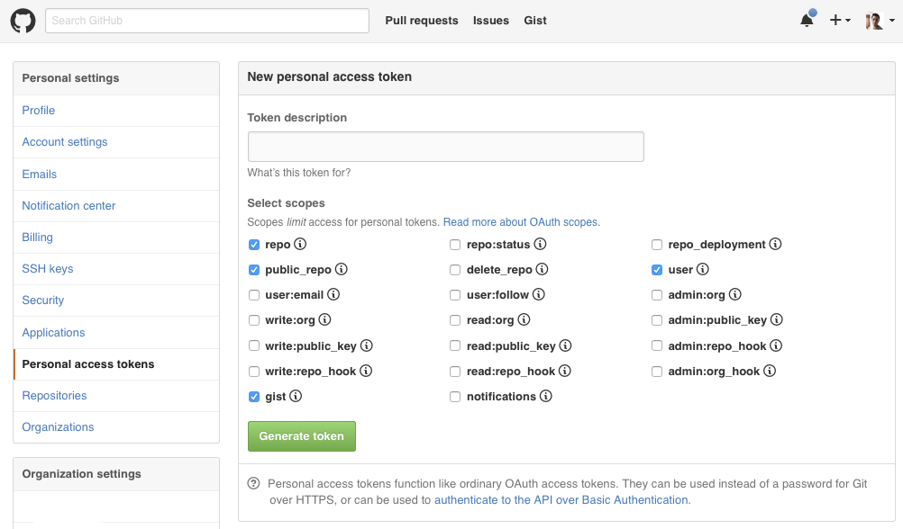
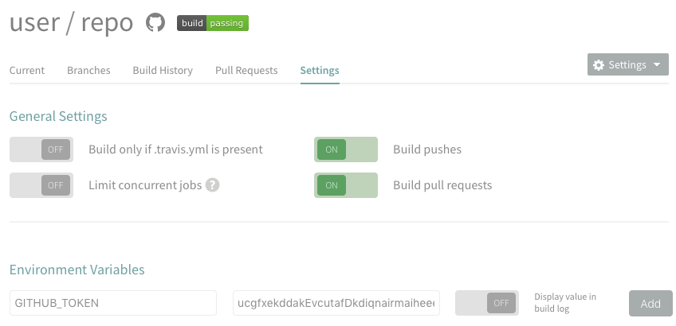

# git-update-ghpages

Uploads a directory to gh-pages. Perfect for use with Travis-CI deployments.

```
git-update-ghpages rstacruz/myproject _docs
```

```
==> cd /var/folders/7d/tmp.9dgEYWLD
==> git init
Initialized empty repository in /var/folders/7d/tmp.9dgEYWLD

==> git checkout -b gh-pages
Switch to a new branch 'gh-pages'

==> Copying contents from _docs
x index.html
x license.html
x contributing.html

==> git commit -m Update
[gh-pages 06829a94] Update
  16 files changed, 16085 insertions(+)

==> git push https://github.com/rstacruz/myproject.git gh-pages
==> rm -rf /var/folders/7d/tmp.9dgEYWLD
==> Done.
```

[](https://travis-ci.org/rstacruz/git-update-ghpages "See test builds")

## Automated Travis deployment

You can use Travis to automatically deploy your static website to GitHub pages.

#### Generate a GitHub token

Generate a [GitHub token](https://github.com/settings/tokens/new). Travis will use this to push to your repository on your behalf. You can use any name, but you can call it _Travis CI_. Keep this token somewhere safe; you can use it for any of your repositories that will need git-update-ghpages deployments.

> 

#### Adding your token

Make sure Travis is already enabled on your repository. Go to your Travis's repo's settings page (`https://travis-ci.org/user/repo/settings`), and add your token there as `GITHUB_TOKEN`.
 Be sure to turn off the "show this in build log" option.

> 

Alternatively, you can also use the [Travis CLI tool](http://rubygems.org/gems/travis) to add this to your repo as a secure variable:

```sh
travis encrypt GITHUB_TOKEN="your token here" --add
```

#### Configuring builds

Add this to your `.travis.yml` manifest. This will make a build happen after your test, then a deployment right after that. uIn this example, we're deploying `_docs` to `user/repo`.

```yaml
# .travis.yml
env:
  global:
    - GIT_NAME: Travis CI
    - GIT_EMAIL: nobody@nobody.org
    - GITHUB_REPO: rstacruz/myproject
    - GIT_SOURCE: docs

script:
- npm test     # ...or whatever your test command is
- make build   # ...or whatever your build command is

after_success:
- if [ "$TRAVIS_BRANCH" = "master" -a "$TRAVIS_PULL_REQUEST" = "false" ]; then npm install git-update-ghpages && ./node_modules/.bin/git-update-ghpages -e; fi
```

#### For Node.js projects

If your project is a Node.js project, you can simplify this by adding `git-update-ghpages` to your *devDependencies*.

```sh
npm install --save-dev --save-exact git-update-ghpages
```

```yaml
# .travis.yml
after_success:
- if [ "$TRAVIS_BRANCH" = "master" -a "$TRAVIS_PULL_REQUEST" = "false" ]; then ./node_modules/.bin/git-update-ghpages -e; fi
```
